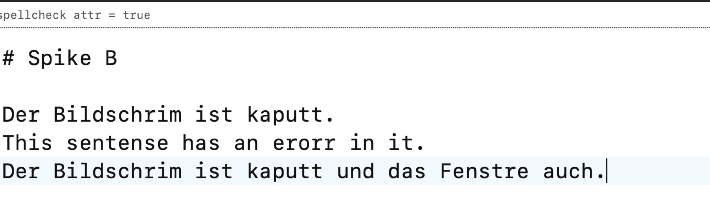
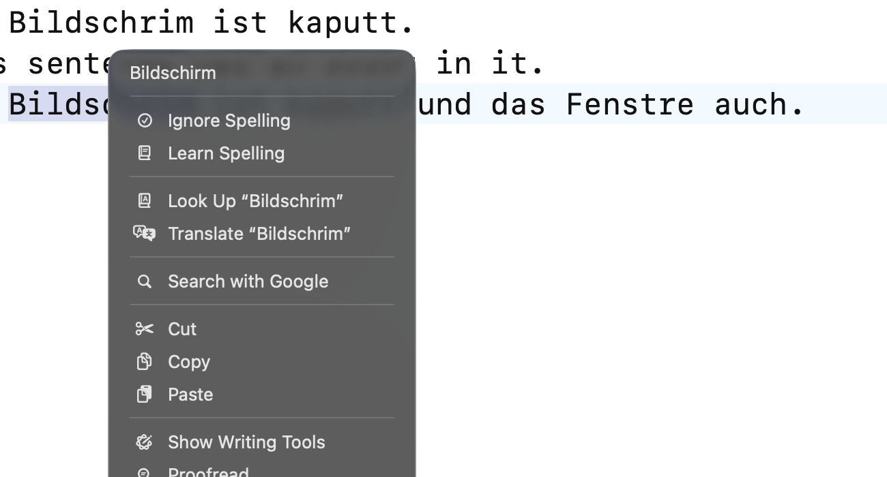
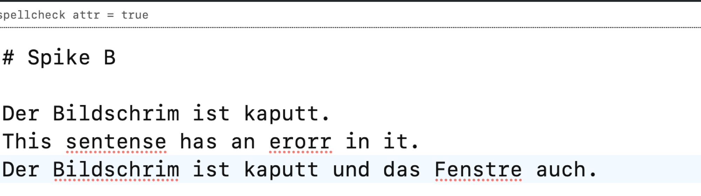
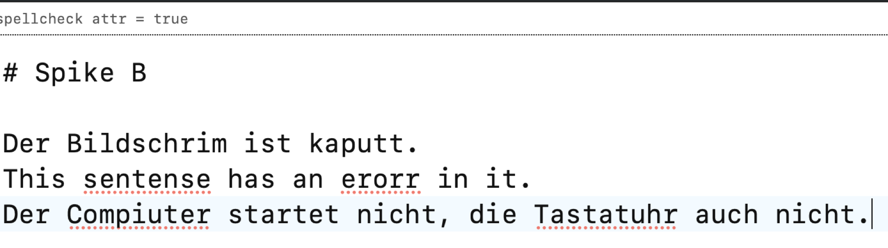

# Spike B — WKWebView spellcheck underlines on macOS 26.6

PLAN.md §12 Phase 0 item 4 / §7.5 · upstream issue tauri-apps/tauri#7705
Run on 2026-09-05, Apple Silicon, macOS 26.6 (build 25G72), WebKit framework build 21624.

## Question

Does WKWebView paint the red spellcheck squiggles inside the CodeMirror 6 editor
of the scaffolded Tauri app, or is only the right-click menu wired up (as
tauri-apps/tauri#7705 has claimed since 2023)?

## Answer

**Reproduced: no red underlines in the default state — but the cause is a single
`NSUserDefaults` key, not a missing WebKit feature, and setting that key turns the
underlines on.** Both the German and the English dictionary then mark words while
typing, with WebKit's automatic language identification picking the language per
paragraph. The right-click menu offers native suggestions in *both* states.

| Run | `spellcheck` attribute on `.cm-content` | `WebContinuousSpellCheckingEnabled` | Red underlines | Right-click suggestions |
|---|---|---|---|---|
| 1 | `true` | unset (fresh app) | **no** | yes |
| 2 | `true` | set via `toggleContinuousSpellChecking:` | **yes** | yes |
| 3 | `true` | set via `defaults write … -bool YES` before launch | **yes** | yes |

The `spellcheck="true"` attribute that `apps/desktop/ui/src/editor/setup.ts`
already puts on the CodeMirror content element is necessary but **not**
sufficient. WebKit's UI-process text checker reads its continuous-spell-checking
state from the application's own `NSUserDefaults` domain under the key
`WebContinuousSpellCheckingEnabled`. For a freshly installed app that key is
absent, `boolForKey:` returns `NO`, and WebKit never runs the checker as you
type — so nothing is marked, no matter what the DOM says. Safari writes that key
from its own Edit ▸ Spelling menu item, which is why the same page underlines
correctly in Safari and not in a freshly built Tauri app.

## Method

The scaffolded app could not be used as the vehicle — see "The scaffolded app
would not paint" below. The measurement was made in a WKWebView harness that
loads **the real CodeMirror 6 build from this workspace** (`@codemirror/view`
6.43.11, `state` 6.7.3, `commands` 6.11.0, `lang-markdown` 6.5.2, `language`
6.12.4, bundled out of `apps/desktop/ui/node_modules`) with exactly the
`contentAttributes` that `setup.ts` sets:

```js
EditorView.contentAttributes.of({
  spellcheck: String(hooks.spellcheck),
  autocorrect: "off",
  autocapitalize: "off",
})
```

The harness is a plain `WKWebView` in an app bundle with its own identifier
(`io.github.grundhofer.novalis.spikeb`), i.e. its own defaults domain. It never
touches WebKit's text-checker state, and neither does the stack: `spell`,
`textchecker` and `WebContinuous` have **no match anywhere** in the sources of
wry 0.55.1 or tauri 2.11.5 (both grepped in the vendored crates this workspace
resolves to). What the harness measures is therefore WebKit's default behaviour
for any app that embeds a `WKWebView`, Tauri included. Per run: launch, activate,
type a misspelled German sentence with `osascript` System Events `keystroke`
("Bildschrim", "Fenstre"; run 3 used "Compiuter", "Tastatuhr"), wait ~2.5 s,
capture the window with `screencapture -l <windowid>` (window id from a small
`CGWindowListCopyWindowInfo` helper).

System state during the runs: `AppleLanguages = (de-DE, en-DE)`,
`NSPreferredSpellServerLanguage` unset (= *Automatic by Language*),
`NSSpellChecker.automaticallyIdentifiesLanguages = true`, `de` present in
`NSSpellChecker.availableLanguages`.

## Observations

**Run 1 — default state, no underlines.**
`WebContinuousSpellCheckingEnabled` was absent from the domain (verified with
`defaults read`, which reported "Domain … does not exist"). Typed
"Der Bildschrim ist kaputt und das Fenstre auch." — the text lands in the
editor, `spellcheck` reads `true` on `.cm-content`, and nothing is marked.



Full window: `2026-09-05-spike-b-1-default-window.png`

**Run 1, right-click.** In that same default state, right-clicking "Bildschrim"
opens the native menu with the correct suggestion "Bildschirm" at the top,
followed by *Ignore Spelling* / *Learn Spelling* and the *Spelling and Grammar*
submenu. So the German dictionary is running and reachable — only the drawing is
off.



**Run 2 — `toggleContinuousSpellChecking:`.**
`WKWebView` answers `responds(to: Selector("toggleContinuousSpellChecking:")) == true`.
Sending it once (what an Edit ▸ Spelling ▸ "Check Spelling While Typing" menu
item does) flips the state and persists `WebContinuousSpellCheckingEnabled = 1`
into the app's domain. Red dotted underlines appear under "Bildschrim" and
"Fenstre" (German) and under "sentense" and "erorr" (English) in the same
buffer.



Full window: `2026-09-05-spike-b-3-continuous-on-window.png`

**Run 3 — user default only, no selector call.**
Domain deleted, then `defaults write io.github.grundhofer.novalis.spikeb
WebContinuousSpellCheckingEnabled -bool YES`, then launch. The harness makes no
API call at all. "Compiuter" and "Tastatuhr" are underlined while typing. So
writing (or registering) the key is enough; no private API, no `objc2` message
send is required to get the underlines.



**Nuance worth knowing.** Turning the key on does not mark the whole document at
once. In run 2 the hand-typed line and the pre-loaded English line
("This sentense has an erorr in it.") were both marked, but the pre-loaded German
line ("Der Bildschrim ist kaputt.") — same buffer, never touched — stayed clean.
I did not establish which rule WebKit applies here (it is neither "only the
edited line" nor "the whole document"). Practically: opening an existing note
will not light up every mistake in it at once, and some untouched text stays
unmarked until the caret has been near it. Worth one more look in Phase 3 if
"marks everything on open" is expected behaviour.

## Recommendation

**Ship underlines in v1, not in v1.1 — and drop the `NSSpellChecker` decoration
plan.** §7.5's fallback (painting CM6 decorations from `NSSpellChecker` via
`objc2-app-kit`) would be several hundred lines of position mapping,
invalidation and theming to reimplement what WebKit already does correctly with
IME, dead keys and per-paragraph language identification. It is not worth it for
a key that costs one line.

Concretely, for the desktop shell (not written by this spike):

1. At startup, seed the app's own defaults domain
   (`io.github.grundhofer.novalis`) with
   `WebContinuousSpellCheckingEnabled = <settings.spellcheck>` before the
   webview is created. Use `registerDefaults:`-style seeding or a plain write —
   run 3 shows a plain write is enough. This is app-local state in the app's own
   `NSUserDefaults` domain, not a new setting and not a fifth key in
   `settings.json`; the existing `spellcheck` setting (PLAN.md §4.1) stays the
   single source of truth.
2. Bind the existing Edit ▸ Spelling ▸ "Check Spelling While Typing" item
   (`settings.spellcheck` in `apps/desktop/src-tauri/src/menu.rs`) to both the
   defaults key and the CM6 `spellcheck` attribute, so the menu item keeps
   meaning what it says. `WKWebView` also answers
   `toggleContinuousSpellChecking:` directly (via Tauri's `with_webview()`), which
   is the tidier route if the menu item should stay a pure "send this action".
3. Keep the `spellcheck` content attribute exactly as it is — it is still
   required. Keep `autocorrect: "off"` / `autocapitalize: "off"`: this spike did
   not touch automatic substitution, and turning the checker on must not start
   rewriting Markdown behind the user's back.
4. Update PLAN.md §7.5 and the §14 risk row ("Spellcheck underlines stay hidden").
   The symptom in #7705 is real and still present on macOS 26.6, but its
   mitigation is not the one the plan budgeted for: the fix is one user-defaults
   key in v1, not `NSSpellChecker` decorations in v1.1. Remove "spellcheck
   underlines via `NSSpellChecker` if Spike B failed" from the Phase 5 list.

One thing this spike could not measure and that is worth ten minutes in Phase 3,
once the shell paints: that the key has the same effect inside the actual Tauri
window. wry and tauri provably do not touch the text checker (the grep above), so
there is no known mechanism by which it would differ — but the step from "any
`WKWebView` app" to "this app" is reasoning, not an observation.

## The scaffolded app would not paint — retracted 2026-09-05

**This section's conclusion was wrong and is retracted.** The spike reported that
the scaffolded app's webview renders an empty document, with an `AXWebArea` of 0
children, and inferred that React never mounts. Re-tested the same day against
the same bundle:

- The app renders correctly. With no vault it shows the styled empty state; with
  a vault it shows the tree, the tab strip, the decorated-source editor and the
  status bar (`docs/spikes/2026-09-05-spike-b-app-works.png`).
- What was actually measured was **window occlusion**. WebKit stops rendering a
  window that is fully covered by other windows, so the backing store
  `screencapture -l<id>` copies is empty and the accessibility tree of the web
  area is empty with it. Every "blank" capture in this spike was taken while a
  terminal covered the app. Activating the app first and then capturing shows the
  real UI.
- A probe inside the running webview confirmed it independently: with the window
  occluded, the DOM was complete and correct (`.win` 1280×800, visible,
  `background rgb(8, 8, 11)`, one stylesheet) while the captured pixels were the
  bare macOS window grey `#1e1e1e`.

The one real defect this spike found is the build hook, which is fixed:

- `tauri.conf.json`'s `beforeBuildCommand` was `pnpm --dir ../ui build`. The
  Tauri CLI runs that hook from the **frontend** directory (`apps/desktop/ui`),
  not from `apps/desktop`, so it resolved to `apps/desktop/ui/ui` and failed with
  `ENOENT`. It is now plain `pnpm build`, and `beforeDevCommand` is `pnpm dev`.
  `cargo tauri build --debug --bundles app` and `just app` work.

Method note for later spikes: **capture the app while it is frontmost**, or the
measurement describes the compositor rather than the program.

## Artefacts

Screenshots (all in this directory, captured at 2× via `screencapture -l`):

| File | What it shows |
|---|---|
| `2026-09-05-spike-b-1-default-window.png` | Run 1, whole harness window |
| `2026-09-05-spike-b-1-default-zoom.png` | Run 1, editor text — no underlines |
| `2026-09-05-spike-b-2-context-menu.png` | Run 1, right-click menu with "Bildschirm" |
| `2026-09-05-spike-b-3-continuous-on-window.png` | Run 2, whole harness window |
| `2026-09-05-spike-b-3-continuous-on-zoom.png` | Run 2, red underlines de + en |
| `2026-09-05-spike-b-4-defaults-write-only-zoom.png` | Run 3, underlines from the user default alone |
| `2026-09-05-spike-b-5-scaffold-blank-window.png` | The occluded window — an artefact, see the retraction above |

The harness (Swift `WKWebView` app bundle, the CodeMirror entry point and its
bundle, and the window-id / click helpers) lived in the session scratchpad and is
not checked in; it is ~90 lines of Swift plus a 25-line CM6 entry point and is
faster to rewrite than to maintain. Everything it did is listed under "Method".

Cleanup after the run: both apps quit, the harness's defaults domain deleted, and
the `io.github.grundhofer.novalis` config directory this spike created removed
again (it did not exist before). The debug binary inside `novalis.app` was
replaced with an equivalent fresh `cargo build` of the same sources.
